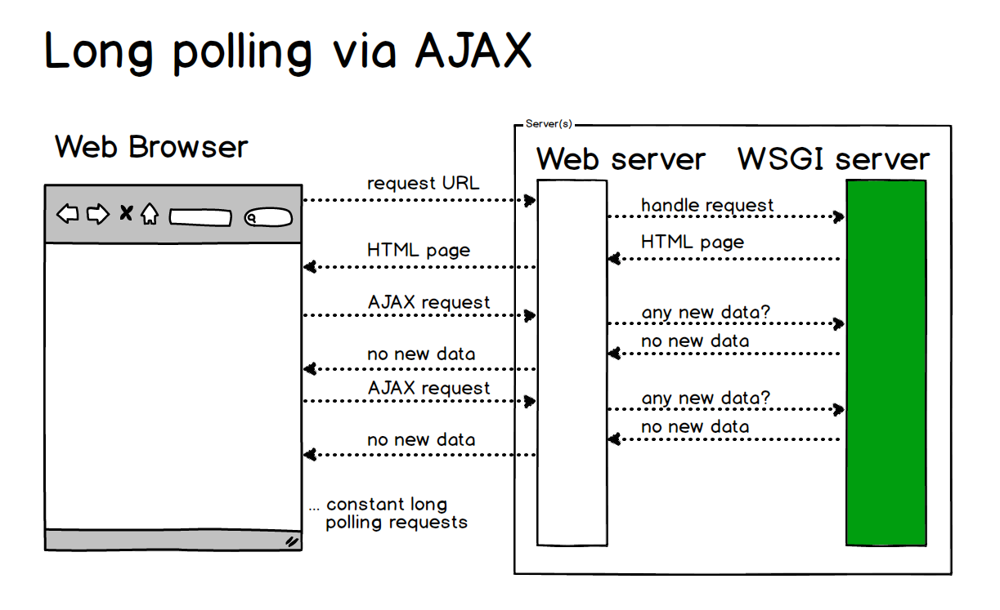

# WebSocket

## 概述
### WebSocket 是什么？
WebSocket 是一种网络通信协议。RFC6455 定义了它的通信标准。

WebSocket 是 HTML5 开始提供的一种在单个 TCP 连接上进行全双工通讯的协议。


### 为什么需要 WebSocket ？

了解计算机网络协议的人，应该都知道：HTTP 协议是一种无状态的、无连接的、单向的应用层协议。它采用了请求/响应模型。通信请求只能由客户端发起，服务端对请求做出应答处理。

这种通信模型有一个弊端：HTTP 协议无法实现服务器主动向客户端发起消息。

这种单向请求的特点，注定了如果服务器有连续的状态变化，客户端要获知就非常麻烦。大多数 Web 应用程序将通过频繁的异步JavaScript和XML（AJAX）请求实现长轮询。轮询的效率低，非常浪费资源（因为必须不停连接，或者 HTTP 连接始终打开）。



因此，工程师们一直在思考，有没有更好的方法。WebSocket 就是这样发明的。WebSocket 连接允许客户端和服务器之间进行全双工通信，以便任一方都可以通过建立的连接将数据推送到另一端。WebSocket 只需要建立一次连接，就可以一直保持连接状态。这相比于轮询方式的不停建立连接显然效率要大大提高。


### WebSocket 如何工作？
Web浏览器和服务器都必须实现 WebSockets 协议来建立和维护连接。由于 WebSockets 连接长期存在，与典型的HTTP连接不同，对服务器有重要的影响。

基于多线程或多进程的服务器无法适用于 WebSockets，因为它旨在打开连接，尽可能快地处理请求，然后关闭连接。任何实际的 WebSockets 服务器端实现都需要一个异步服务器。


## WebSocket 客户端

### 客户端 API

以下 API 用于创建 WebSocket 对象。
```javascript
var Socket = new WebSocket(url, [protocol] );
```
以上代码中的第一个参数 url, 指定连接的 URL。第二个参数 protocol 是可选的，指定了可接受的子协议。

### WebSocket 属性
以下是 WebSocket 对象的属性。假定我们使用了以上代码创建了 Socket 对象：
<table>
<tr>
	<td><b>属性</b></td>
	<td><b>描述</b></td>
</tr>
<tr>
	<td>Socket.readyState</td>
	<td>只读属性 readyState 表示连接状态，可以是以下值：0 - 表示连接尚未建立。1 - 表示连接已建立，可以进行通信。2 - 表示连接正在进行关闭。3 - 表示连接已经关闭或者连接不能打开。</td>
</tr>
<tr>
	<td>Socket.bufferedAmount</td>
	<td>只读属性 bufferedAmount 已被 send() 放入正在队列中等待传输，但是还没有发出的 UTF-8 文本字节数。</td>
</tr>
</table>

### WebSocket 事件

<table>
	<tr>
		<td>事件</td>
		<td>事件处理程序</td>
		<td>描述</td>
	</tr>
	<tr>
		<td>open</td>
		<td>Socket.onopen</td>
		<td>连接建立时触发</td>
	</tr>
	<tr>
		<td>message</td>
		<td>Socket.onmessage</td>
		<td>客户端接收服务端数据时触发</td>
	</tr>
	<tr>
		<td>error</td>
		<td>Socket.onerror</td>
		<td>通信发生错误时触发</td>
	</tr>
	<tr>
		<td>close</td>
		<td>Socket.onclose</td>
		<td>连接关闭时触发</td>
	</tr>
</table>

### WebSocket 方法


<table>
	<tr>
		<td>方法</td>
		<td>描述</td>
	</tr>
	<tr>
		<td>Socket.send()</td>
		<td>使用连接发送数据</td>
	</tr>
	<tr>
		<td>Socket.close()</td>
		<td>关闭连接</td>
	</tr>
</table>

### 示例
```javascript
// 初始化一个 WebSocket 对象
var ws = new WebSocket("ws://localhost:9998/echo");

// 建立 web socket 连接成功触发事件
ws.onopen = function () {
  // 使用 send() 方法发送数据
  ws.send("发送数据");
  alert("数据发送中...");
};

// 接收服务端数据时触发事件
ws.onmessage = function (evt) {
  var received_msg = evt.data;
  alert("数据已接收...");
};

// 断开 web socket 连接成功触发事件
ws.onclose = function () {
  alert("连接已关闭...");
};
```

## 资料
1. [WebSocket 是什么原理？为什么可以实现持久连接？](https://www.zhihu.com/question/20215561)
2. [WebSocket教程](http://www.ruanyifeng.com/blog/2017/05/websocket.html)